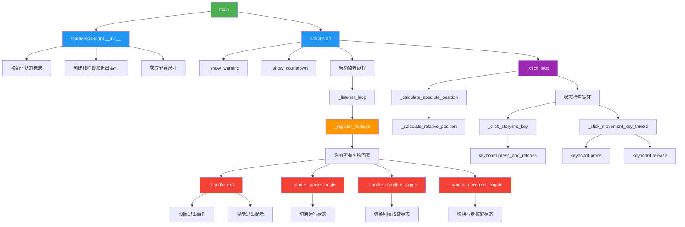
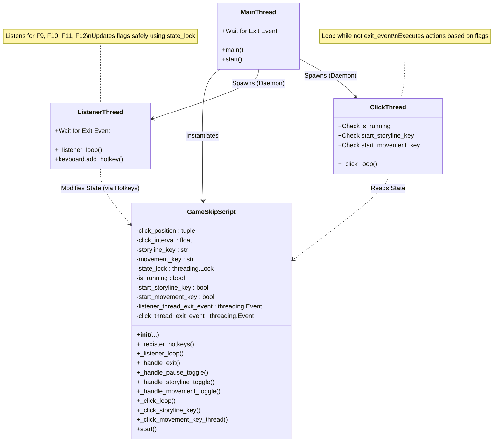

# SkipPlots_Script

## Introduction

本脚本用于自动跳过《原神》游戏中的剧情动画和对话，以及自动行走（移动）以提升游戏体验。理论上来说也支持其他米哈游的游戏，但只在《原神》上进行了测试。

## Prerequisites

- Operating System: Windows 10/11
- Python 3.8 or higher

## Installation

1. **Step 1: Clone the Repository**

   ```bash
   git clone https://github.com/WenXingming/Genshin_SkipPlots.git
   cd Genshin_SkipPlots
   ```

2. **Step 2: Install Required Packages**
   You can use python directly, or create a conda virtual environment with python 3.8+. Then install the required packages using pip:

   ```bash
   # Create conda environment
   # conda create -n genshin_skip_plots python=3.8
   # conda activate genshin_skip_plots
   pip install keyboard
   pip install pyautogui
   ```

## Usage

Run the script using Python (if unused, you may run it with administrator privileges):

```bash
# conda activate genshin_skip_plots
python SkipPlots_Script.py
```

## Reference architecture diagram

函数调用流程图（DeepSeek 生成）：



程序设计架构图（Google Gemini 生成）：



## License
